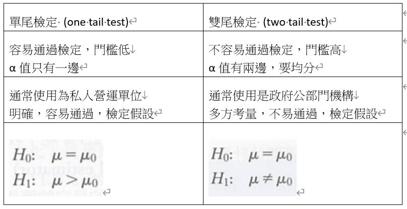

```{r setup, include = F}
knitr::opts_chunk$set(echo = TRUE, message = FALSE, 
                      warning = FALSE, fig.align = "center")
```

# Introduction

In this study, we can practice the knowledge about the t-test from assumption identified to hypothesis established.

# Preparation

## Environment

```{r}
if(!require("pacman")) install.packages("pacman")
pacman::p_load(dplyr, kableExtra, skimr, ggplot2, GGally, ggsci, car)
theme = theme_bw() +
  theme(plot.title = element_text(face = "bold", size = (15)),
        plot.subtitle = element_text(size = (10)),
        axis.title = element_text(size = (10))) +
  theme(axis.text.x = element_text(angle = 0), legend.position = "none")
```

Let us set up the working environment and be ready for the analysis.

## Dataset

```{r}
df = read.csv("DATA.csv",
              stringsAsFactors = T)
df$LandID = as.factor(df$LandID)
df %>% 
  kbl(align = "c",
      caption = "Sugarbeets Yield on Herbicide Environment Dataset") %>% 
  kable_classic("hover", "bordered", "striped")
```

Two kinds of sugar beet plant on five different lands separately. Both have been producing relatively similar yields historically. As sprayed lands with the herbicide last month, both of the sugar beets are still yielding but some differences have been noticed.

```{r}
skim_without_charts(df)
```

Here is the summary of the dataset.

```{r}
ggpairs(df,
        columns = c("Yield", "Variety", "LandID"),
        aes(color = Variety,
            alpha = 0.5)) +
  theme +
  theme(axis.text.x = element_blank(),
        axis.text.y = element_blank(),
        axis.ticks.x = element_blank(),
        axis.ticks.y = element_blank()) +
  scale_fill_locuszoom() +
  labs(caption = "RD: Merlin\nOG: Golden")
```

The ensemble plot can tell the distribution and structure in yield with different groups. It appears that the statistics of Merlin variety is doing better than the Golden variety. We will apply statistical tests to prove the statistical difference or not.

# Statistical Analysis

## Two sample t-test

```{r}
a = c("Student’s two sample t-test",
      "Welch’s t-test",
      "Paired t-test",
      "Wilcoxon Matched Pairs",
      "Mann Whitney test")
b = c("v", "v", "v", "x", "x")
c = c("x", "x", "v", "v", "x")
d = c("v", "x", "\\-", "\\-", "\\-")

data.frame(a, b, c, d) %>% 
  rename("Two sample t-tests" = "a",
         "Normally distributed?" = "b",
         "Paired?" = "c",
         "Equal variance?" = "d") %>% 
  kbl(align = "l",
      caption = "v: Yes, x: No, -: Not required") %>% 
  kable_classic("hover", "bordered", "striped")
```

The table summarizes the three conditions to be fulfilled before deciding which t-test to use.

1. Are both variables normally distributed?
2. Are the samples in a paired trial? Commonly known as before/after sample objects experiencing two conditions.
3. Do they have equal variance?

We can apply additional tests for 1 and 3. Whereas for 2, we can only decide based on the experimental design for sampling.

### Shapiro-wilk test of normality

- Null hypothesis (H0): normally distributed
- Alternative hypothesis (H1): not normally distributed

```{r}
by(df$Yield, df$Variety, shapiro.test)
```

P-value of both Golden and Merlin sugar beet varieties show that the results are not significant and thus we can not reject H0 and accept H0, in which both yields of Golden and Merlin are normally distributed.

As long as one variable is not normally distributed, the result of this text is considered not normally distributed.

Thus, normally distributed is checked as v.

### Deciding are the samples paired

Paired sampling is before/after the experiment. Data are measured in one object. This is not the sampling or experiment way of this dataset collecting.

Thus, data paired is checked as x.

### Bartlett's test for homogeneity of variance

- Null hypothesis (H0): variances are equal
- Alternative hypothesis (H1): variances are not equal

```{r}
bartlett.test(data = df, Yield ~ Variety)
```

Bartlett's test is used for testing the homogeneity of variances. It is adapted for normally distributed data.

```{r}
leveneTest(data = df, Yield ~ Variety)
```

Levene's test is a more robust alternative to Bartlett's test when the distributions of the data are non-normal.

In this case, we will take Bartlett's test result due to normally distributed data. P-value as greater than 0.05, we can not reject H0 and accept H0, which assumes variances are equal.

Thus, equal variance is checked as v.

### Student’s two sample t-test

1. Normally distributed? - v
2. Data paired? - x
3. Equal variance? - v

It is clearly that the assumption of student's two sample t-test is fulfilled, and this will be used to computed to test the statistical differences between its data.

```{r}
t.test(df$Yield ~ df$Variety, var.equal = T)
```

It is the student's two sample t-test from R. It shows that the mean value of Merlin is higher than Golden in a significant difference as p-value < 0.05. We can reject H0 and accept H1, which there is a significant difference between Merlin and Golden.

In detail, this is a two tail two sample student's t-test. As two tail, the hypothesis is that means is/not equal.

If having a more specific purpose for the test, we can set up one tail test, which the hypothesis is that means is/not greater/lesser.

```{r}
t.test(df$Yield ~ df$Variety, var.equal = T,
       alternative = "less")
```

So, in this way, the difference in means (Golden - Merlin) is statistically difference less than 0 as p-value < 0.05. The p-value is only half of the two tail test.



## One sample t-test

### Assumpted Merlin as population

```{r}
mer = df %>% filter(Variety == "Merlin") %>% select(Yield) %>% colMeans() %>% unname()
gol = df %>% filter(Variety == "Golden") %>% select(Yield)
t.test(gol, mu = mer, var.equal = T,
       alternative = "less")
```

In this example, we know that Golden yield in our sample is statistically lower than our assumpted population parameter mean (47.4) due to p-value < 0.05.

### Assumpted Golden as population

```{r}
mer = df %>% filter(Variety == "Merlin") %>% select(Yield)
gol = df %>% filter(Variety == "Golden") %>% select(Yield) %>% colMeans() %>% unname()
t.test(mer, mu = gol, var.equal = T,
       alternative = "greater")
```

In this example, we know that Merlin yield in our sample is statistically higher than our assumpted population parameter mean (34.85) due to p-value < 0.05.

# Conclusion

If Merlin production is the usual production rate of the farm, we said that production of both varieties was somewhat equal before herbicide application. Keeping all other environmental and human factors equal, we may say the reduction of Golden variety could be due to herbicide application with the support of the statistical results.

# Reference

- [Statistical Analysis / 2021 / Kar Ng](https://t.ly/ZOO7)
